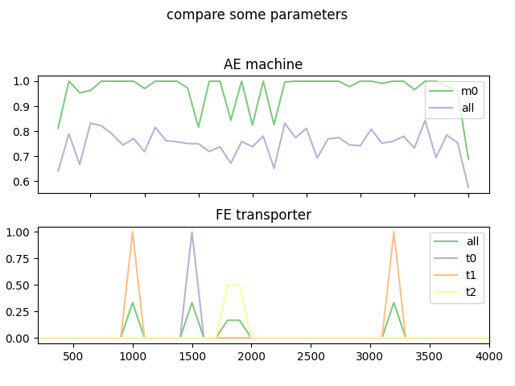
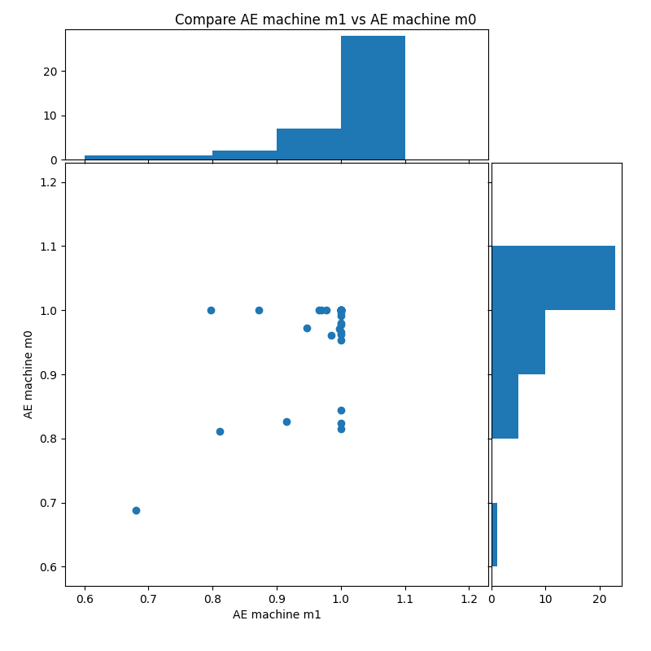

Plot ini
==============

the plot config is used to plot the results from the log folder. The plot config is used for the ``MainPlot.py`` in the example folder

Log
---------

defines the log-folder and the location, where the plot's should be saved

**Main Structure**

.. list-table::
   :widths: 20 80
   :header-rows: 1

   * - Key
     - Value
   * - path_dir
     - bool: True or False, defines if all events should be saved
   * - save_dir
     - relative path, where the log files should be changed
   * - file_type
     - list of the selected output formats, possible types: eps, pdf, pgf, png, ps, raw, rgba, svg, svgz

**Example**

.. code-block:: JSON

    [Log]
    path_dir="/example/log/11292020_07-19-15_5_3"
    save_dir="/example/log/11292020_07-19-15_5_3/plot"
    #supported: formats eps, pdf, pgf, png, ps, raw, rgba, svg, svgz
    file_type=['png','svg','pdf']

Style
---------

defines the plot style

**Main Structure**

.. list-table::
   :widths: 20 80
   :header-rows: 1

   * - Key
     - Value
   * - colormap
     - defines the colors
   * - marker
     - defines the marker style, the first marker is the standard marker

For further colormaps view: `Classes of colormaps <https://matplotlib.org/tutorials/colors/colormaps.html>`__
For marker style view: `matplotlib.markers <https://matplotlib.org/api/markers_api.html?highlight=marker#module-matplotlib.markers>`__

**Example**

.. code-block:: JSON

    [Style]
    colormap="Accent"
    marker=['','o','r']

LinePlot
---------

plot's one kpi as line plot

**Main Structure**

.. list-table::
   :widths: 20 80
   :header-rows: 1

   * - Key
     - Value
   * - y_data
     - list of dict with {'kpi':name of kpi,'type','object_name': (optional) [list of labels]}

* the following types are defined: machine, transporter, queue, product, transporter_distribution, simulation
* object_name: optional parameter, if not defined all labels + 'all' are used, if object_name is defined only the labels in the list are shown, therefore object_name is used as filter

**Example**

.. code-block:: JSON

    [LinePlot]
    #without object name all data are shown
    y_data=[{'kpi':'AE','type':'machine','object_name':['m0','all']},{'kpi':'FillLevel','type':'queue'}]

.. figure:: line_plot_AE_machine.png
   :align: center

MultipleLinePlot
------------------

plot's multiple kpi as line plot, each kpi has it's own subchart

**Main Structure**

.. list-table::
   :widths: 20 80
   :header-rows: 1

   * - Key
     - Value
   * - y_data
     - list of dict with {'title':str,'data':[{'kpi','type','object_name' (optional)}]} the data dict is identical to line plot

* the following types are defined: machine, transporter, queue, product, transporter_distribution, simulation
* object_name: optional parameter, if not defined all labels + 'all' are used, if object_name is defined only the labels in the list are shown, therefore object_name is used as filter

**Example**

.. code-block:: JSON

    [MultipleLinePlot]
    #max 3 kpis
    settings=[{'title':"compare some parameters",'data':[{'kpi':'AE','type':'machine','object_name':['m0','all']},{'kpi':'FE','type':'transporter'}]}]

ScatterPlot
------------------

compares two kpi as a scatter plot with histogram at both axes

**Main Structure**

.. list-table::
   :widths: 20 80
   :header-rows: 1

   * - Key
     - Value
   * - x_data
     - list of dict with {'kpi','type','object_name' (optional)} the dict is identical to line plot
   * - y_data
     - list of dict with {'kpi','type','object_name' (optional)} the dict is identical to line plot

* the following types are defined: machine, transporter, queue, product, transporter_distribution, simulation
* object_name: optional parameter, if not defined all labels + 'all' are used, if object_name is defined only the labels in the list are shown, therefore object_name is used as filter
* the first x_data is correlated with the first y_data and so on

**Example**

.. code-block:: JSON

    [ScatterPlot]
    x_data=[{'kpi':'AE','type':'machine','object_name':'m1'},{'kpi':'A','type':'machine','object_name':'m1'}]
    y_data=[{'kpi':'AE','type':'machine','object_name':'m0'},{'kpi':'A','type':'machine','object_name':'m0'}]

Complete file
---------------

this file is available in ``example/config/plot_log.ini``

.. code-block:: JSON

    [Log]
    path_dir="/example/log/11292020_07-19-15_5_3"
    save_dir="/example/log/11292020_07-19-15_5_3/plot"
    #supported: formats eps, pdf, pgf, png, ps, raw, rgba, svg, svgz
    file_type=['png','svg','pdf']

    [Style]
    colormap="Accent"
    marker=['','o','r']

    [LinePlot]
    #without object name all
    y_data=[{'kpi':'AE','type':'machine','object_name':['m0','all']},{'kpi':'FillLevel','type':'queue'}]

    [MultipleLinePlot]
    #max 3 kpis
    settings=[{'title':"compare some parameters",'data':[{'kpi':'AE','type':'machine','object_name':['m0','all']},{'kpi':'FE','type':'transporter'}]}]

    [ScatterPlot]
    x_data=[{'kpi':'AE','type':'machine','object_name':'m1'},{'kpi':'A','type':'machine','object_name':'m1'}]
    y_data=[{'kpi