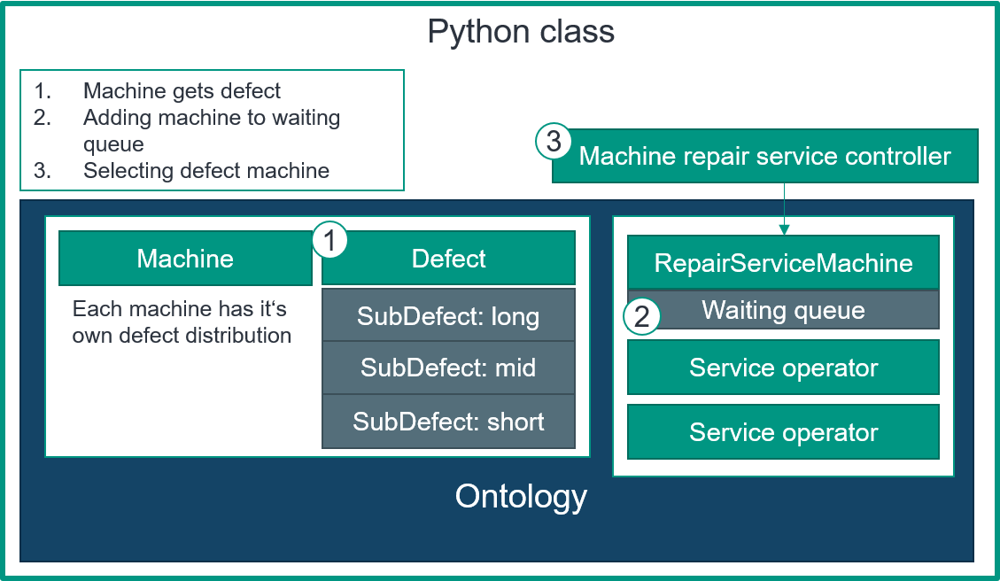

Defect and Service
===================

**Defect**

* Only machines and transporter an go defect
    * the machine queues can still add or remove products
* A defect is divided in multiple sub defects, which can be defined individual
    * therefore for selecting the next defect. First the type is selected and then the next defect
* A defect is directly connected to one machine/ transporter 
   
**Repair service**

* the simulation has one repair service, but can have multiple service operators
* the controller decides which defect machine should be prioritized
* the machine repair service and the transporter repair service are seperated

